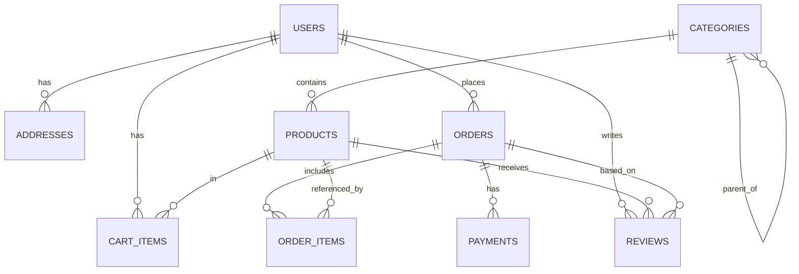

# MySQL 数据库设计（淘宝风格电商）

> 目标：覆盖电商核心链路（用户 → 商品 → 购物车 → 下单 → 支付 → 评价），并兼顾扩展性与查询性能。

## 1. 表清单

| 表名 | 说明 |
|---|---|
| `users` | 用户账号与基础资料 |
| `addresses` | 用户收货地址（可多条） |
| `categories` | 商品分类（支持多级，常用二级） |
| `products` | 商品 SPU（基础商品信息） |
| `cart_items` | 购物车明细（用户-商品维度唯一） |
| `orders` | 订单主表（订单状态、总价、收货地址快照等） |
| `order_items` | 订单明细（商品快照，避免商品改名/改价影响历史订单） |
| `payments` | 支付记录（与第三方交易号关联） |
| `reviews` | 评价（可选，但已提供表结构） |

---

## 2. 核心关系（ER 关系图）

关系说明：
- 一个用户拥有多条地址、多个购物车条目、多个订单。
- 分类为自关联（`parent_id`），支持多级分类树（常见为一级/二级）。
- 商品归属一个分类（`products.category_id`）。
- 订单与订单明细为 1:N；订单明细包含商品名称/价格等快照字段。
- 支付记录与订单为 1:N（例如多次支付/重试/分笔），常见情况下为 1:1。
- 评价通常基于订单产生，并关联用户与商品。

---

## 3. 表结构与字段说明（摘要）

> 详细字段以 `init_schema.sql` 为准。

### 3.1 `users`
- `username` / `email`：唯一约束（同时也是索引）。
- `password_hash`：存储哈希后的密码（建议 bcrypt/argon2）。
- `is_active`：软禁用。
- `created_at` / `updated_at`：自动维护时间。

### 3.2 `addresses`
- `user_id`：外键指向 `users.id`（ON DELETE CASCADE）。
- `is_default`：默认地址标记（索引 `user_id, is_default` 便于快速取默认地址）。

> 注意：MySQL 对“每个用户只能有一个默认地址”的强约束（部分唯一）实现比较麻烦，推荐由业务层保证；或在扩展时使用生成列 + 唯一索引 / 触发器实现。

### 3.3 `categories`
- `parent_id`：自引用外键，删除父分类时对子分类做 `SET NULL`，避免级联误删。
- `sort_order`：用于展示排序。

### 3.4 `products`
- `images`：JSON 数组，存放多张图片 URL。
- `sales_count`：销量统计（可异步维护）。
- `rating`：评分（0~5），包含 CHECK 约束（MySQL 8.0+ 强制生效）。
- 常用索引：`category_id`、`is_active`、`name`（搜索/列表页）。

### 3.5 `cart_items`
- 唯一约束：`(user_id, product_id)`，保证同一用户同一商品在购物车只出现一条。
- `quantity`：CHECK `> 0`。

### 3.6 `orders`
- `order_number`：业务单号（唯一）。
- `shipping_address`：收货地址快照（下单时固化，避免用户修改地址影响历史订单）。
- `status`：订单状态（`pending/paid/shipped/delivered/cancelled`）。
- 常用索引：`user_id`、`status`、`created_at`。

### 3.7 `order_items`
- `product_name` / `unit_price`：商品快照字段。
- `subtotal`：行小计（通常为 `unit_price * quantity`）。

### 3.8 `payments`
- `transaction_id`：第三方支付交易号（唯一索引）。
- `status`：`pending/success/failed`。

### 3.9 `reviews`
- 唯一约束：`(order_id, product_id, user_id)`，避免重复评价。
- `rating`：1~5。

---

## 4. 索引策略（核心点）

1. **唯一性与登录检索**
   - `users.username`、`users.email`：唯一索引，既保证唯一又支持快速登录查询。
2. **列表页 / 运营位**
   - `products(category_id, is_active)`：支持“按分类 + 上架状态”高频查询。
   - `categories.parent_id`：支持快速取二级分类列表。
3. **订单查询**
   - `orders(user_id, created_at)`：支持“我的订单”按时间分页。
   - `orders.status`：支持按状态筛选（待支付/待发货等）。
4. **购物车一致性**
   - `cart_items(user_id, product_id)` 唯一索引：保障幂等加购。

---

## 5. 初始化脚本说明

- 根目录：
  - `init_schema.sql`：建表 + 外键 + 索引
  - `init_data.sql`：示例分类/商品/用户/订单/支付/评价等测试数据
- Node.js 常用目录（便于接入迁移工具）：
  - `migrations/001_init_schema.sql`
  - `migrations/002_init_data.sql`

---

## 6. 扩展建议（更贴近淘宝/天猫的真实复杂度）

1. **SPU/SKU 与规格属性**
   - `product_skus`（SKU 级库存/价格）、`product_attributes`、`sku_attribute_values`
2. **店铺/商家模型（多商家）**
   - `shops`、`shop_users`、`shop_products`
3. **营销系统**
   - 优惠券：`coupons`、`user_coupons`
   - 满减/秒杀/拼团：活动表 + 活动规则表
4. **履约/物流**
   - `shipments`、`shipment_events`（轨迹）
5. **售后体系**
   - `refunds`、`returns`、`after_sales_tickets`
6. **风控与审计**
   - 登录日志、操作日志、支付风控策略
7. **搜索**
   - 可将商品检索接入 Elasticsearch/OpenSearch；MySQL 侧可增加 FULLTEXT 或关键词表

